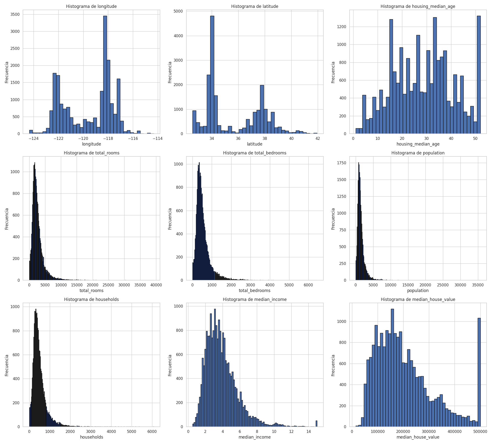
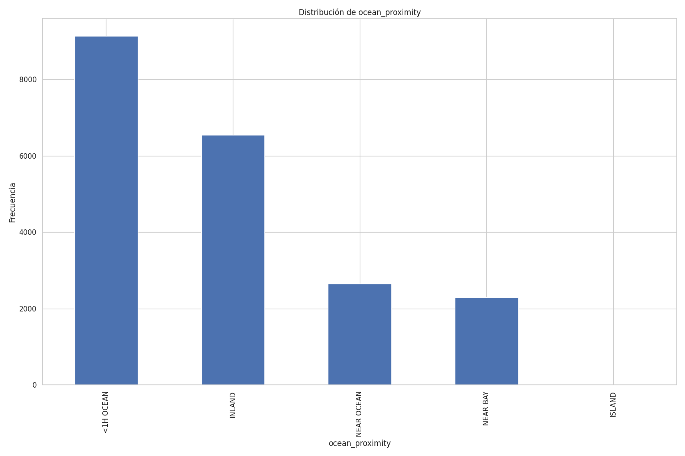
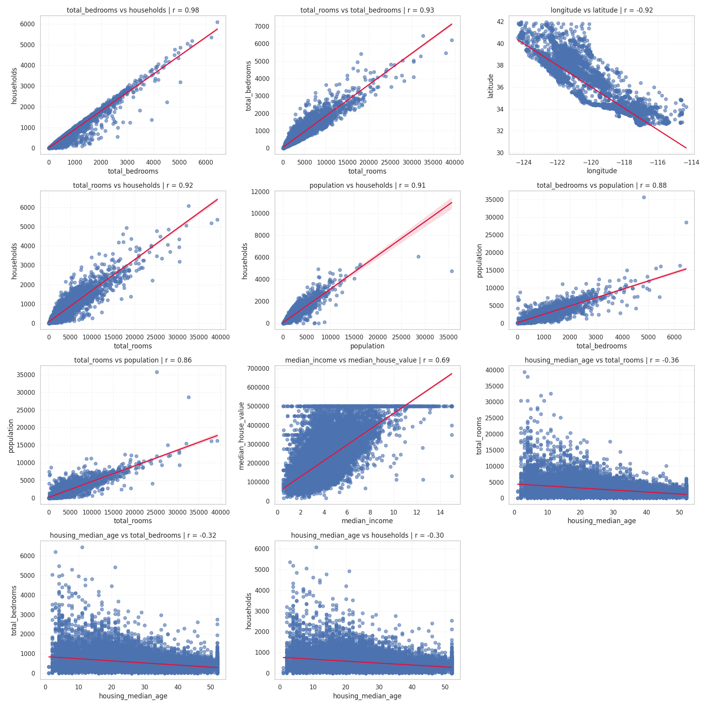
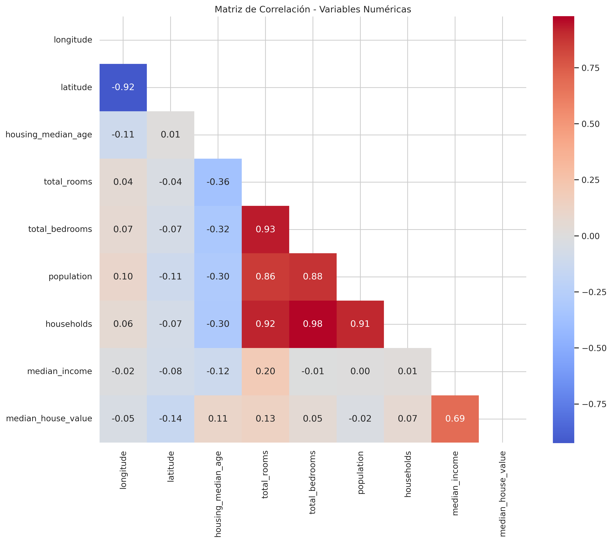
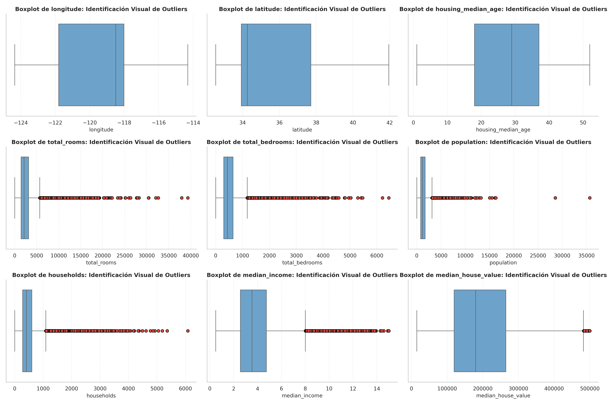
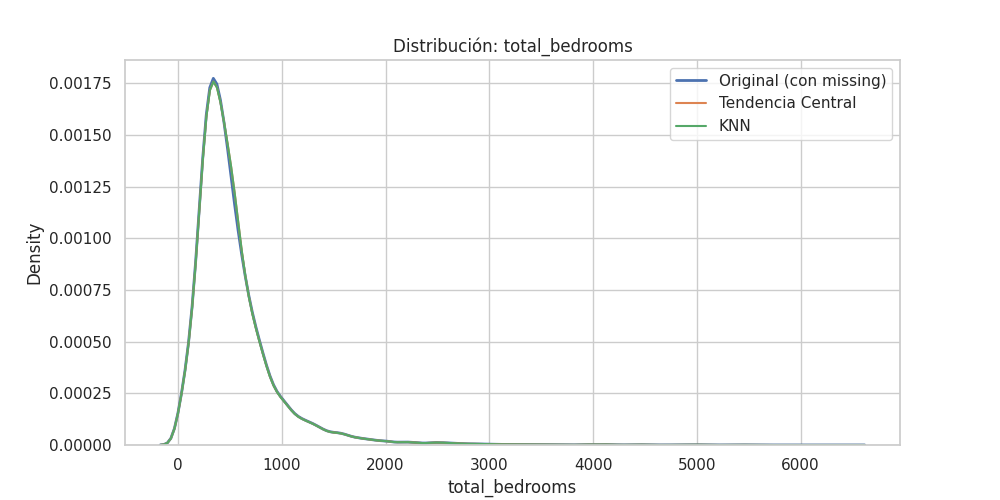
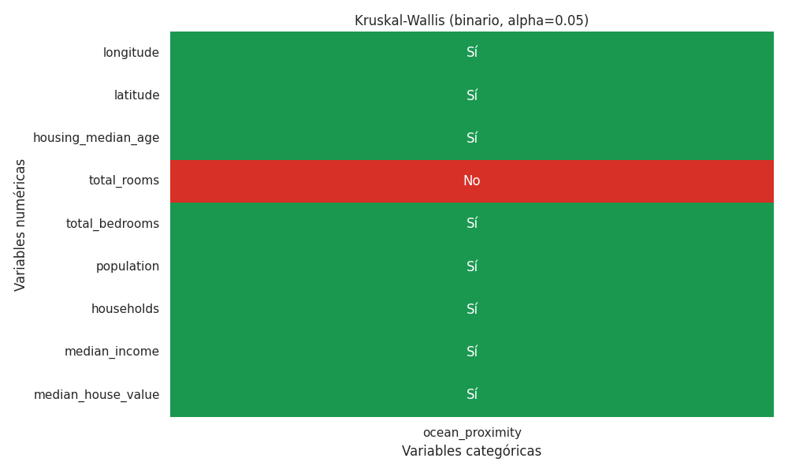

# Informe de Laboratorio #3: Analítica de Datos para House Pricing Dataset
**Asignatura:** Analítica de Datos  
**Facultad:** Ciencias Exactas y Naturales - Universidad de Antioquia  
**Estudiantes:** Edwin Daniel Patiño, Xiomara Saldarriaga Duque
**Profesor:** Duván Cataño  

## 1. Introducción
Este documento detalla el análisis exploratorio realizado sobre el conjunto de datos de precios de viviendas. El objetivo principal es comprender la distribución de las variables, identificar problemas de calidad en los datos y analizar las relaciones estadísticas que fundamentarán el posterior modelo de regresión.

## 2. Descripción de los datos

El conjunto de datos utilizado corresponde al dataset de **California Housing Prices**, el cual contiene información sobre viviendas en el estado de California (Estados Unidos) basada en datos del censo de finales de la década de 1990.

Este dataset es ampliamente utilizado en problemas de análisis de datos y aprendizaje automático para la predicción del valor de viviendas a partir de características socioeconómicas y geográficas.

El conjunto contiene variables tanto numéricas como categóricas, las cuales se describen a continuación:

### Variables numéricas

- `longitude`: Longitud geográfica de la vivienda.
- `latitude`: Latitud geográfica de la vivienda.
- `housing_median_age`: Edad mediana de las viviendas en la zona.
- `total_rooms`: Número total de habitaciones.
- `total_bedrooms`: Número total de dormitorios.
- `population`: Población total en el área.
- `households`: Número de hogares.
- `median_income`: Ingreso medio de los hogares.
- `median_house_value`: Valor medio de las viviendas (variable objetivo).

### Variables categóricas

- `ocean_proximity`: Ubicación de la vivienda respecto al océano, con categorías como:
  - `<1H OCEAN`
  - `INLAND`
  - `NEAR OCEAN`
  - `NEAR BAY`
  - `ISLAND`

### Observaciones generales

- El dataset recoge información de diferentes distritos censales en California, lo que introduce variabilidad geográfica relevante.
- Incluye tanto variables continuas como variables de conteo.
- La variable `median_house_value` es la variable objetivo del problema de predicción.
- Este conjunto de datos permite estudiar la relación entre factores económicos, demográficos y de localización en el precio de la vivienda.

En general, se trata de un dataset adecuado para aplicar técnicas de análisis exploratorio, modelado estadístico y aprendizaje automático.

## 3. Carga y Gestión de Datos (SQL)
### Query 1

| ocean_proximity | cantidad |
| --------------- | -------- |
| <1H OCEAN       | 9136     |
| INLAND          | 6551     |
| NEAR OCEAN      | 2658     |
| NEAR BAY        | 2290     |
| ISLAND          | 5        |

La variable `ocean_proximity` presenta un fuerte desbalance, con predominio de `<1H OCEAN` e `INLAND`. La categoría `ISLAND` es prácticamente insignificante, lo que puede afectar el modelado.

### Query 2
| ocean_proximity | valor_medio |
|-----------------|-------------|
| ISLAND          | 380440.00   |
| NEAR BAY        | 259212.31   |
| NEAR OCEAN      | 249433.98   |
| <1H OCEAN       | 240084.29   |
| INLAND          | 124805.39   |

El valor medio de la vivienda aumenta con la cercanía al océano. `INLAND` tiene los precios más bajos, mientras que zonas cercanas al agua son más costosas. `ISLAND` debe interpretarse con cautela por su baja frecuencia.

### Query 3
| total_nulos_dormitorios |
|--------------------------|
| 207                      |

Existen 207 valores nulos en `total_bedrooms`, una proporción baja pero relevante. Se recomienda imputación en lugar de eliminación de datos.

### Query 4
| nivel_ingreso_aproximado | cantidad_bloques | valor_medio_vivienda |
|--------------------------|------------------|-----------------------|
| 0.0                      | 12               | 163608.50             |
| 1.0                      | 803              | 111308.10             |
| 2.0                      | 3962             | 123258.18             |
| 3.0                      | 5316             | 168874.91             |
| 4.0                      | 4522             | 210610.35             |
| 5.0                      | 2807             | 249001.10             |
| 6.0                      | 1564             | 299215.92             |
| 7.0                      | 704              | 359022.45             |
| 8.0                      | 443              | 407835.05             |
| 9.0                      | 155              | 453050.88             |
| 10.0                     | 134              | 467316.37             |
| 11.0                     | 86               | 488783.41             |
| 12.0                     | 37               | 494846.89             |
| 13.0                     | 32               | 477516.47             |
| 14.0                     | 10               | 500001.00             |
| 15.0                     | 53               | 488327.36             |

Se evidencia una relación positiva clara entre el nivel de ingreso (`median_income`) y el valor medio de la vivienda. A medida que aumentan los ingresos, los precios de las viviendas crecen de forma sostenida, especialmente en los niveles bajos e intermedios, lo que confirma su alto poder explicativo.

En los niveles de ingreso más altos, aunque los precios siguen siendo elevados, se observa una menor cantidad de registros y una estabilización de los valores cerca del límite superior (~500000). Esto sugiere la presencia de truncamiento en la variable objetivo, lo cual puede afectar el comportamiento del modelo en valores extremos.

### Query 5
| ocean_proximity | promedio_personas_por_hogar | valor_medio_vivienda |
|-----------------|-----------------------------|----------------------|
| INLAND          | 3.30                        | 124805.39            |
| <1H OCEAN       | 3.05                        | 240084.29            |
| NEAR OCEAN      | 2.95                        | 249433.98            |
| NEAR BAY        | 2.62                        | 259212.31            |
| ISLAND          | 2.38                        | 380440.00            |

El promedio de personas por hogar muestra un patrón claro en función de la proximidad al océano. Las zonas `INLAND` presentan los valores más altos, indicando mayor densidad habitacional, mientras que en áreas cercanas al océano este promedio disminuye progresivamente.

Adicionalmente, se observa que las zonas con menor número de personas por hogar tienden a tener mayores valores medios de vivienda, lo que sugiere una relación inversa entre densidad y precio. Esto puede estar asociado a factores socioeconómicos, donde áreas más exclusivas presentan hogares más pequeños.

La categoría `ISLAND` sigue este patrón, aunque sus resultados deben interpretarse con cuidado debido a su baja cantidad de observaciones.

## 4. Análisis exploratorio EDA

### 4.1 Análisis Exploratorio

| estadístico | longitude   | latitude   | housing_median_age | total_rooms | total_bedrooms | population  | households | median_income | median_house_value |
|-------------|-------------|------------|---------------------|-------------|----------------|-------------|------------|---------------|--------------------|
| mean        | -119.569704 | 35.631861  | 28.639486           | 2635.763081 | 537.870553     | 1425.476744 | 499.539680 | 3.870671      | 206855.816909      |
| median      | -118.490000 | 34.260000  | 29.000000           | 2127.000000 | 435.000000     | 1166.000000 | 409.000000 | 3.534800      | 179700.000000      |
| std         | 2.003532    | 2.135952   | 12.585558           | 2181.615252 | 421.385070     | 1132.462122 | 382.329753 | 1.899822      | 115395.615874      |
| min         | -124.350000 | 32.540000  | 1.000000            | 2.000000    | 1.000000       | 3.000000    | 1.000000   | 0.499900      | 14999.000000       |
| max         | -114.310000 | 41.950000  | 52.000000           | 39320.000000| 6445.000000    | 35682.000000| 6082.000000| 15.000100     | 500001.000000      |

Las variables de conteo (`total_rooms`, `total_bedrooms`, `population`, `households`) presentan media mayor que la mediana, lo que indica asimetría a la derecha y presencia de valores extremos, lo cual se confirma con los valores máximos elevados.

La variable `median_house_value` también muestra este comportamiento y presenta un valor máximo cercano a 500000, evidenciando un posible truncamiento en los datos.

Las desviaciones estándar son altas, reflejando gran variabilidad. Además, la diferencia entre valores mínimos y máximos es considerable, especialmente en variables de conteo.

Las variables geográficas presentan menor dispersión relativa, como es esperable.

En conjunto, se confirma la presencia de asimetría y alta variabilidad, lo que sugiere la necesidad de aplicar transformaciones en el modelado.

| estadístico | ocean_proximity |
|-------------|-----------------|
| mode        | <1H OCEAN       |

La categoría más frecuente es `<1H OCEAN`, lo que indica que la mayoría de las viviendas se encuentran ubicadas a menos de una hora del océano.

Esto confirma el predominio de esta categoría en el dataset y refuerza el desbalance previamente observado en la variable.

### 4.2 Visualización de Distribuciones

A partir de los histogramas de las variables numéricas y categóricas, se observan los siguientes patrones:

#### Variables geográficas: `longitude` y `latitude`

- Presentan distribuciones multimodales.
- Esto indica que los datos no están uniformemente distribuidos, sino concentrados en ciertas zonas geográficas.
- Es consistente con datos de vivienda donde existen clusters urbanos.

La ubicación es una variable relevante y posiblemente no lineal, por lo que puede requerir modelos más complejos o transformaciones.

---

#### `housing_median_age`

- Distribución relativamente dispersa.
- Se observa acumulación en valores altos cercanos al máximo.

Puede existir truncamiento o límite superior en la variable.

---

#### `total_rooms`, `total_bedrooms`, `population`, `households`

- Presentan fuerte asimetría a la derecha (right-skewed).
- Hay muchos valores pequeños y pocos valores extremadamente grandes.

- Existen outliers significativos.
- Es recomendable aplicar transformaciones (por ejemplo, logarítmica) o escalamiento robusto.

---

#### `median_income`

- Distribución asimétrica a la derecha, pero menos pronunciada.
- Mayor concentración en valores bajos y medios.

 
Es una variable potencialmente muy importante para la predicción del precio de vivienda.

---

#### `median_house_value`

- Distribución asimétrica a la derecha.
- Se observa acumulación en el valor máximo (~500000).

Muestra un pico en el extremo derecho, sugiriendo un límite superior en la recolección de los datos (datos truncados).
---

#### Variable categórica: `ocean_proximity`

- Distribución desbalanceada:
  - `"<1H OCEAN"` e `"INLAND"` son las categorías predominantes.
  - `"ISLAND"` tiene muy pocas observaciones.

### 4.3 Análisis de Correlación
El examen de las relaciones lineales y los diagramas de dispersión (`regplot`) arroja las siguientes observaciones clave:

* **Multicolinealidad Crítica:** Existe una dependencia lineal casi perfecta ($r > 0.90$) entre `total_rooms`, `total_bedrooms`, `population` y `households`. Matemáticamente, esto sugiere redundancia; se recomienda transformar estas variables en ratios (ej. habitaciones por hogar) para evitar que la matriz de diseño del modelo sea singular o inestable.

* **Predictor Principal:** La variable `median_income` presenta la correlación más fuerte con el target ($r = 0.69$). El gráfico de dispersión confirma una relación lineal positiva, consolidándola como la característica con mayor capacidad explicativa para la regresión.

* **Truncamiento de Datos:** Los gráficos revelan una acumulación atípica de registros en el límite de los 500,000 USD. Esta "censura por la derecha" en la variable objetivo debe considerarse, ya que puede sesgar las predicciones y afectar la distribución de los residuos en los valores más altos.

* **Factores Geográficos:** Se detecta un gradiente negativo respecto a la `latitud`, indicando que la ubicación espacial influye sistemáticamente en la valoración inmobiliaria de la región.
Se ha calculado el coeficiente de correlación de Pearson para identificar las correlaciones de las variables numéricas: 

Las representaciones de las correlaciones fueron las siguientes:

#### 4.4 Detección de valores atípicos (outliers)

Se realizó un análisis de valores atípicos en las variables numéricas del conjunto de datos. Los resultados obtenidos son los siguientes:

- `longitude`: 0 outliers  
- `latitude`: 0 outliers  
- `housing_median_age`: 0 outliers  
- `total_rooms`: 1287 outliers  
- `total_bedrooms`: 1271 outliers  
- `population`: 1196 outliers  
- `households`: 1220 outliers  
- `median_income`: 681 outliers  
- `median_house_value`: 1071 outliers  

Se observa que las variables relacionadas con conteos (`total_rooms`, `total_bedrooms`, `population`, `households`) presentan una alta cantidad de valores atípicos. Esto es consistente con las distribuciones altamente sesgadas a la derecha observadas en los histogramas.

Por otro lado, las variables geográficas (`longitude`, `latitude`) y `housing_median_age` no presentan valores atípicos, lo que indica una distribución más controlada o acotada.

La variable `median_income` presenta una cantidad moderada de outliers, mientras que la variable objetivo `median_house_value` también presenta una cantidad considerable, posiblemente asociada a la censura en valores máximos observada previamente.

**Implicaciones:**

- La presencia de outliers puede afectar el rendimiento de modelos sensibles como la regresión lineal.
- Puede influir en medidas estadísticas como la media y la varianza.
- También puede impactar pruebas estadísticas como Kruskal-Wallis.

## 5. Análisis de Calidad de Datos

Durante la exploración inicial del conjunto de datos se identificaron los siguientes aspectos relevantes:

### Datos faltantes

Se detectó la presencia de valores nulos en la columna `total_bedrooms`. En total, se encontraron 207 valores faltantes, lo que corresponde aproximadamente al 1.002% del total de los datos.

Dado que la proporción de datos faltantes es relativamente baja, se optó por aplicar técnicas de imputación en lugar de eliminar los registros.

Se evaluaron dos estrategias de imputación:

- **Imputación por tendencia central:** utilizando la media o mediana de la variable.
- **Imputación mediante KNN (K-Nearest Neighbors):** considerando la similitud entre observaciones.

La comparación entre las imputaciones realizadas y la distribución original de los datos se presenta en la siguiente gráfica, lo que permite evaluar el impacto de cada método sobre la variable.

## 6. Resultados de pruebas estadísticas
En el punto 3 se pudo observar las correlaciones de variables numéricas, no fue necesario hacer el cálculo para las categóricas porque solo hay una `ocean_proximity`, así que con el objetivo de evaluar la relación entre variables categóricas y numéricas, se aplicó la prueba no paramétrica de **Kruskal-Wallis**.

Esta prueba permite determinar si existen diferencias estadísticamente significativas en la distribución de una variable numérica entre los grupos definidos por una variable categórica.

Se utilizó un nivel de significancia de α = 0.05.

Los resultados se presentan en forma de matriz, donde:

- **"Sí"** indica que se rechaza la hipótesis nula (existen diferencias significativas entre grupos).
- **"No"** indica que no se encontraron diferencias significativas.

En general, se observaron relaciones estadísticamente significativas entre varias variables numéricas y la variable categórica `ocean_proximity`.

- La variable `ocean_proximity` influye significativamente en variables como:
  - `median_house_value`
  - `median_income`
  - y otras variables relacionadas con características de las viviendas.

- Esto sugiere que la ubicación respecto al océano es un factor relevante en la variación de precios y condiciones socioeconómicas.

- Las variables categóricas deben ser consideradas en el modelado predictivo.
- Es recomendable aplicar técnicas de codificación (por ejemplo, one-hot encoding).
- La evidencia estadística respalda la inclusión de `ocean_proximity` como variable explicativa en modelos de predicción.
- La prueba de Kruskal-Wallis no asume normalidad, lo cual es adecuado dado que varias variables presentan asimetría y outliers.
- Sin embargo, no indica qué grupos son diferentes entre sí, solo que al menos uno difiere.

En conjunto, los resultados muestran que existen relaciones significativas entre variables categóricas y numéricas, lo que refuerza la importancia de considerar estas interacciones en el análisis y modelado.

## 7. Conclusiones

A partir del análisis exploratorio y las pruebas estadísticas realizadas, se obtienen las siguientes conclusiones principales:

- Varias variables numéricas presentan **asimetría significativa (sesgo a la derecha)**, especialmente aquellas relacionadas con conteos (`total_rooms`, `total_bedrooms`, `population`, `households`). Esto sugiere la necesidad de aplicar transformaciones (por ejemplo, logarítmica) para mejorar el desempeño de modelos predictivos.

- Se identificó una **alta presencia de valores atípicos**, particularmente en variables de conteo y en la variable objetivo. Estos valores pueden afectar modelos sensibles como la regresión lineal, por lo que se recomienda considerar técnicas robustas o transformaciones adecuadas.

- Existe evidencia de **censura en la variable objetivo (`median_house_value`)**, con acumulación en el valor máximo (~500000). Este fenómeno puede introducir sesgos en la predicción, especialmente en valores altos, y debe ser considerado en la interpretación del modelo.

- Se detectó **multicolinealidad fuerte** entre variables como `total_rooms`, `total_bedrooms`, `population` y `households`. Esto indica redundancia de información, por lo que es recomendable construir variables derivadas (por ejemplo, ratios como habitaciones por hogar) o aplicar técnicas de reducción de dimensionalidad.

- La variable `median_income` se identifica como el **predictor más relevante**, mostrando la mayor correlación con el valor de la vivienda. Esto sugiere que factores económicos tienen un peso determinante en el precio.

- La **ubicación geográfica** (latitud, longitud y proximidad al océano) tiene un impacto significativo en los precios, lo cual fue confirmado tanto visualmente como mediante pruebas estadísticas. Esto indica que la relación entre variables puede ser no lineal y dependiente del espacio.

- La variable categórica `ocean_proximity` mostró **diferencias estadísticamente significativas** respecto a múltiples variables numéricas, lo que refuerza su importancia en el modelado.

- El conjunto de datos presenta **buena calidad general**, con una baja proporción de valores faltantes, los cuales pueden ser tratados mediante imputación sin pérdida significativa de información.

### Conclusión general

En conjunto, el dataset presenta características típicas de datos reales: asimetría, outliers, multicolinealidad y efectos espaciales. Estos aspectos deberán ser tratados adecuadamente en las etapas posteriores de modelado para garantizar resultados robustos y confiables. 

