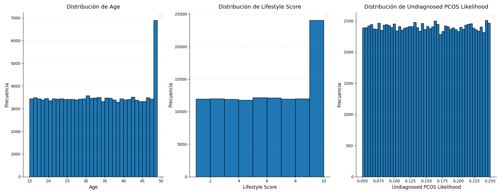
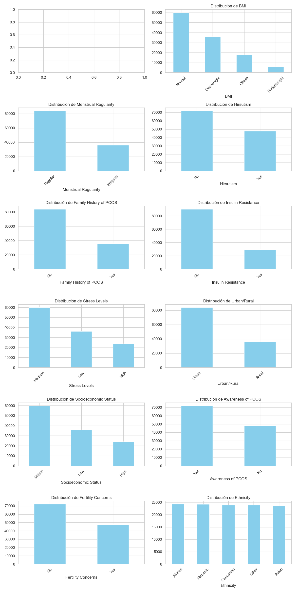
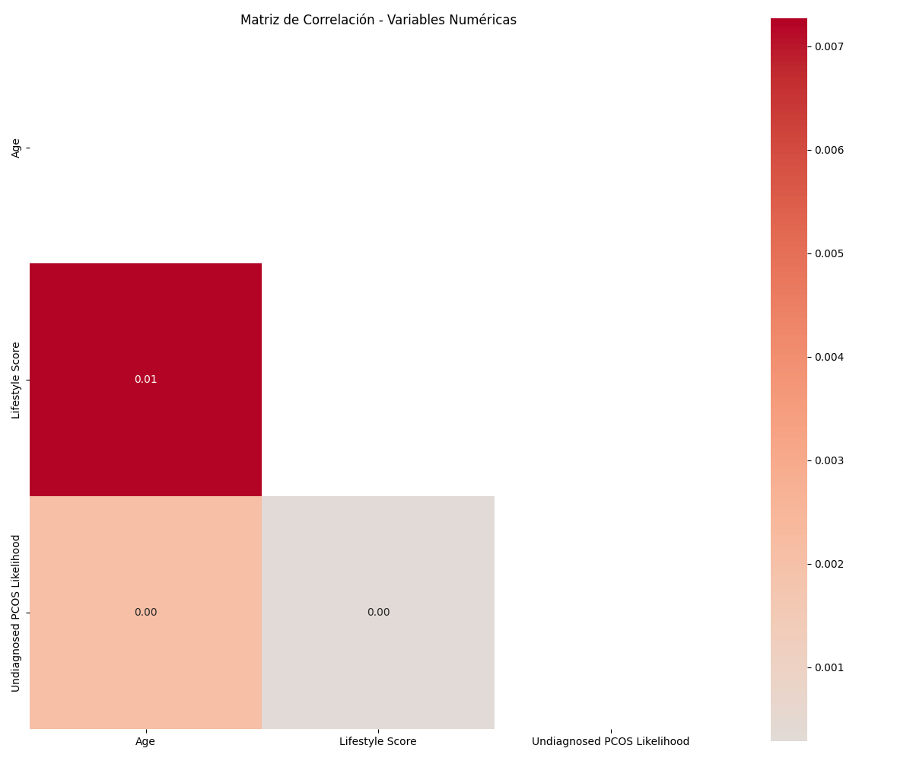
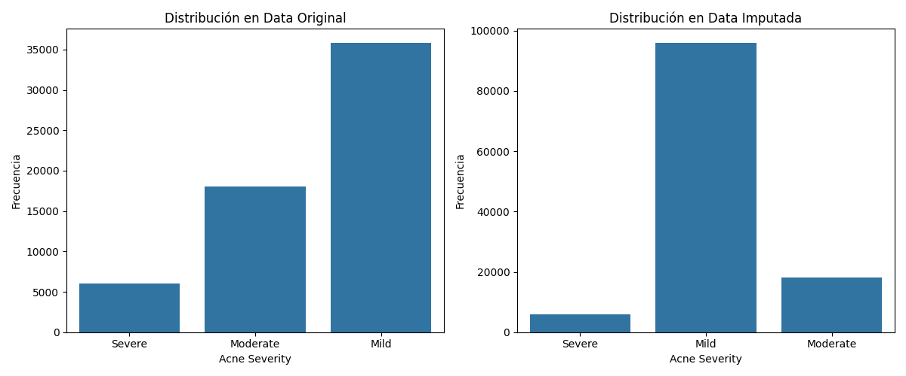
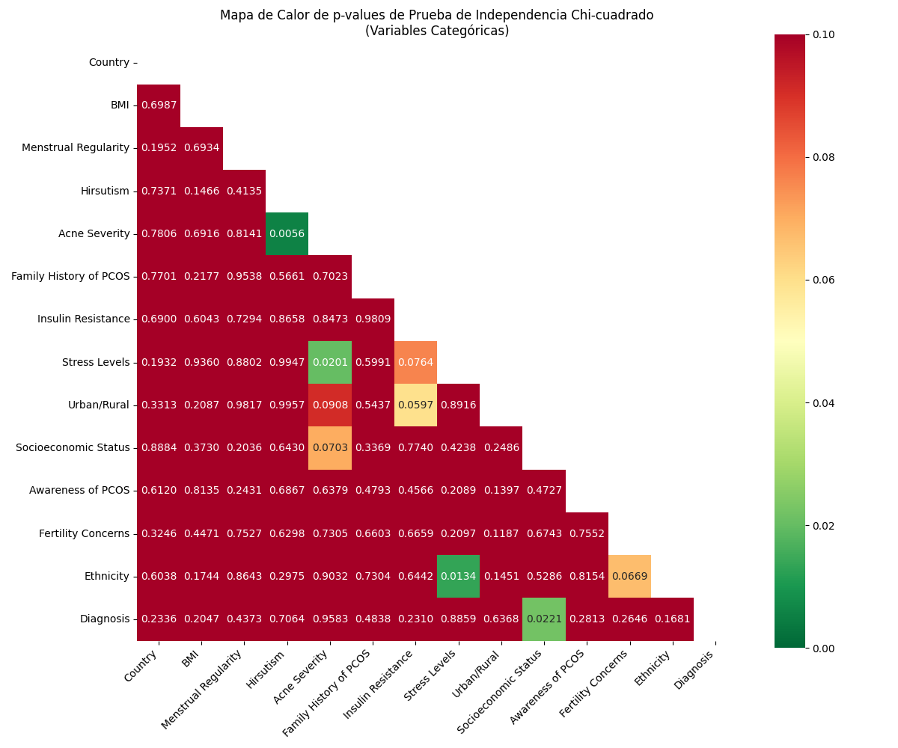
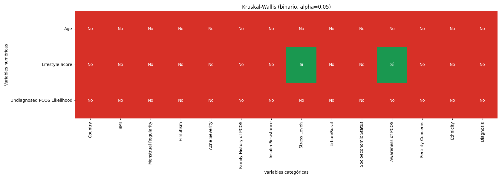

# Informe de Laboratorio #3: Analítica de Datos para Diagnóstico de PCOS
**Asignatura:** Analítica de Datos  
**Facultad:** Ciencias Exactas y Naturales - Universidad de Antioquia  

**Estudiantes:** Edwin Daniel Patiño Osorio , Xiomara Saldarriaga Duque 

**Profesor:** Duván Cataño  

---

## 1. Introducción
Este informe detalla el análisis exploratorio y estadístico realizado sobre un conjunto de datos clínico orientado al diagnóstico del Síndrome de Ovario Poliquístico (PCOS). El objetivo es identificar los factores biológicos y de estilo de vida que presentan mayor dependencia con el diagnóstico positivo, utilizando herramientas de gestión de datos en SQLite y visualización interactiva.

## 2. Descripción de los datos

El conjunto de datos utilizado corresponde a un dataset clínico sobre el síndrome de ovario poliquístico (PCOS), que contiene información de aproximadamente 120,000 pacientes provenientes de 75 países.

Este dataset está diseñado para el análisis de factores clínicos, fisiológicos y socioeconómicos asociados al PCOS, y es adecuado para tareas de análisis exploratorio y modelos de clasificación.

El conjunto contiene variables tanto numéricas como categóricas, las cuales se describen a continuación:

### Variables numéricas

- `Age`: Edad de la paciente.
- `BMI`: Índice de masa corporal.
- `Lifestyle Score`: Indicador numérico del estilo de vida.
- `Undiagnosed PCOS Likelihood`: Probabilidad estimada de PCOS no diagnosticado.

### Variables categóricas

- `Hirsutism`: Presencia de crecimiento excesivo de vello.
- `Insulin Resistance`: Indicador de resistencia a la insulina.
- `Cycle Regularity`: Regularidad del ciclo menstrual.
- `Ethnicity`: Grupo étnico de la paciente.
- `Socioeconomic Status`: Nivel socioeconómico.

### Variable objetivo

- `Diagnosis`: Diagnóstico de PCOS (0: No afectado, 1: Afectado).

### Observaciones generales

- El dataset incluye información de múltiples países, lo que introduce diversidad geográfica y demográfica significativa.
- Combina variables clínicas, fisiológicas y sociales, permitiendo un análisis integral del problema.
- La variable `Diagnosis` permite abordar el problema como una tarea de clasificación binaria.
- La gran cantidad de observaciones favorece la construcción de modelos robustos y generalizables.

En general, se trata de un dataset adecuado para aplicar técnicas de análisis exploratorio, modelado estadístico y aprendizaje automático orientado a la detección del PCOS.
---

## 3. Carga y Gestión de Datos (SQL)
### Query 1
| Diagnosis | total  | porcentaje |
|-----------|--------|------------|
| No        | 107405 | 89.50      |
| Yes       | 12595  | 10.50      |

La variable `Diagnosis` presenta un fuerte desbalance de clases, donde aproximadamente el 89.5% de los casos corresponden a pacientes sin PCOS y solo el 10.5% a pacientes diagnosticadas.

Este desbalance puede afectar el desempeño de modelos de clasificación, favoreciendo la clase mayoritaria. Por ello, será necesario considerar técnicas como balanceo de clases o métricas adecuadas (por ejemplo, recall o F1-score) en el modelado.

### Query 2
| Diagnosis | BMI          | porcentaje |
|-----------|--------------|------------|
| No        | Normal       | 50.08      |
| No        | Obese        | 14.97      |
| No        | Overweight   | 30.05      |
| No        | Underweight  | 4.90       |
| Yes       | Normal       | 49.96      |
| Yes       | Obese        | 14.82      |
| Yes       | Overweight   | 29.89      |
| Yes       | Underweight  | 5.34       |

La distribución del BMI es muy similar entre pacientes con y sin PCOS, con predominio de las categorías `Normal` y `Overweight` en ambos grupos.

No se observan diferencias marcadas en los porcentajes, lo que sugiere que el BMI, por sí solo, no discrimina claramente entre pacientes diagnosticadas y no diagnosticadas.

Sin embargo, puede seguir siendo relevante en combinación con otras variables clínicas dentro de modelos predictivos.

### Query 3

| BMI         | edad_promedio |
|-------------|---------------|
| Normal      | 31.97         |
| Obese       | 32.08         |
| Overweight  | 31.99         |
| Underweight | 31.68         |

La edad promedio es muy similar entre todas las categorías de BMI, situándose alrededor de los 32 años.

No se observan diferencias significativas, lo que sugiere que la edad no varía de forma relevante según el índice de masa corporal en este dataset.

Por tanto, el BMI no parece estar asociado con cambios importantes en la edad de las pacientes.

### Query 4
| Diagnosis | bmi_numerico_promedio |
|-----------|------------------------|
| No        | 2.55                   |
| Yes       | 2.54                   |

El BMI promedio es prácticamente igual entre pacientes con y sin PCOS, con valores cercanos a 2.5 (entre `Normal` y `Overweight`).

Esto indica que no existe una diferencia significativa en el índice de masa corporal promedio entre ambos grupos, por lo que el BMI, de forma aislada, no parece ser un factor determinante en el diagnóstico.

Sin embargo, puede seguir siendo relevante al analizarlo en conjunto con otras variables clínicas.

### Query 5
| Diagnosis | BMI         | Insulin Resistance | cantidad |
|-----------|-------------|--------------------|----------|
| No        | Normal      | No                 | 40438    |
| No        | Normal      | Yes                | 13350    |
| No        | Obese       | No                 | 12085    |
| No        | Obese       | Yes                | 3994     |
| No        | Overweight  | No                 | 24328    |
| No        | Overweight  | Yes                | 7945     |
| No        | Underweight | No                 | 3922     |
| No        | Underweight | Yes                | 1343     |
| Yes       | Normal      | No                 | 4682     |
| Yes       | Normal      | Yes                | 1610     |
| Yes       | Obese       | No                 | 1411     |
| Yes       | Obese       | Yes                | 455      |
| Yes       | Overweight  | No                 | 2814     |
| Yes       | Overweight  | Yes                | 951      |
| Yes       | Underweight | No                 | 503      |
| Yes       | Underweight | Yes                | 169      |

Se observa que la resistencia a la insulina (`Insulin Resistance = Yes`) aparece en todas las categorías de BMI, tanto en pacientes con como sin PCOS, aunque con menor frecuencia que los casos sin resistencia.

En ambos grupos (`Yes` y `No`), la mayor cantidad de registros se concentra en las categorías `Normal` y `Overweight`, lo que sigue el patrón general del dataset.

No se evidencian diferencias drásticas en la distribución conjunta de BMI y resistencia a la insulina entre los grupos, lo que sugiere que estas variables, aunque relevantes clínicamente, no separan claramente los casos de PCOS de forma individual.

Sin embargo, la presencia de resistencia a la insulina en todos los niveles de BMI refuerza su importancia como factor a considerar dentro de un análisis multivariable.

### Query 6
La consulta filtra pacientes con BMI `Obese` y niveles de estrés `High`, permitiendo identificar un subgrupo con posibles factores de riesgo combinados.

Este tipo de segmentación es útil para detectar perfiles específicos dentro del dataset, donde condiciones como obesidad y alto estrés pueden estar asociadas con problemas metabólicos o hormonales.

Aunque no se observa aquí la variable `Diagnosis`, este tipo de grupos puede ser relevante para análisis posteriores, especialmente al estudiar la relación entre factores de estilo de vida y la presencia de PCOS.

## 4. Análisis Exploratorio de Datos (EDA)

### 4.1 Análisis Descriptivo
| estadístico | Age     | Lifestyle Score | Undiagnosed PCOS Likelihood |
|-------------|---------|-----------------|-----------------------------|
| mean        | 31.98   | 5.51            | 0.1499                      |
| median      | 32.00   | 6.00            | 0.1498                      |
| std         | 10.10   | 2.87            | 0.0578                      |
| min         | 15.00   | 1.00            | 0.0500                      |
| max         | 49.00   | 10.00           | 0.2500                      |

Las variables presentan distribuciones relativamente centradas, con medias cercanas a las medianas, lo que sugiere baja asimetría.

La edad se concentra alrededor de los 32 años, con una dispersión moderada. El `Lifestyle Score` muestra variabilidad amplia, cubriendo casi todo su rango posible.

La probabilidad de PCOS no diagnosticado tiene baja variabilidad y valores acotados, lo que indica una distribución estable sin extremos pronunciados.

| estadístico | Country       | BMI    | Menstrual Regularity | Hirsutism | Acne Severity | Family History of PCOS | Insulin Resistance | Stress Levels | Urban/Rural | Socioeconomic Status | Awareness of PCOS | Fertility Concerns | Ethnicity | Diagnosis |
|-------------|---------------|--------|----------------------|-----------|----------------|------------------------|--------------------|---------------|-------------|----------------------|-------------------|--------------------|-----------|-----------|
| mode        | Burkina Faso  | Normal | Regular              | No        | Mild           | No                     | No                 | Medium        | Urban       | Middle               | Yes               | No                 | African   | No        |

La moda indica que el perfil más frecuente corresponde a pacientes de peso `Normal`, con ciclo menstrual regular y sin presencia de condiciones clínicas como hirsutismo, acné severo, resistencia a la insulina o antecedentes familiares de PCOS.

Además, predominan niveles de estrés medios, contexto urbano y nivel socioeconómico medio, junto con cierto grado de conocimiento sobre la condición.

En conjunto, este perfil dominante está asociado a pacientes sin diagnóstico de PCOS, lo que es consistente con el desbalance observado en la variable objetivo.

### 4.2 Visualización de Distribuciones

A partir de los histogramas de las variables numéricas, se observan los siguientes patrones:

#### `Age`

- Distribución aproximadamente uniforme a lo largo del rango (15 a 50 años).
- No se observan concentraciones fuertes en valores específicos.
- Ligera acumulación en valores altos.

La edad no presenta sesgos marcados, lo que sugiere una distribución balanceada en la muestra.

---

#### `Lifestyle Score`

- La distribución no es completamente uniforme, presentando una **mayor concentración en los valores altos**, especialmente en torno a 10.  
- Se observa una **ligera asimetría negativa (sesgo hacia la izquierda)**, debido a la acumulación de datos en el extremo superior del rango.  
- Los valores bajos están menos representados en comparación con los altos.  

Esto sugiere que en el dataset predominan individuos con **estilos de vida más saludables o puntuaciones altas**, en lugar de una distribución homogénea entre todos los niveles.

---

#### `Undiagnosed PCOS Likelihood`

- Distribución bastante uniforme en el intervalo (~0.05 a 0.25).
- Baja variabilidad en comparación con otras variables.
- No se observan valores extremos ni outliers evidentes.

La variable parece estar acotada y controlada, lo que sugiere estabilidad en su generación o cálculo.

---

En general, las variables presentan distribuciones relativamente uniformes, sin sesgos extremos ni outliers marcados. Esto contrasta con datasets de tipo socioeconómico, donde suelen aparecer asimetrías más pronunciadas.

A partir de los gráficos de barras de las variables categóricas, se observan los siguientes patrones:

#### `BMI`

- Predomina la categoría `Normal`, seguida de `Overweight`.
- Las categorías `Obese` y `Underweight` tienen menor representación.

La distribución es coherente con poblaciones generales, sin extremos dominantes.

---

#### `Menstrual Regularity`

- La mayoría de pacientes presenta ciclos `Regular`.
- Una proporción menor corresponde a `Irregular`.

Esto sugiere que la irregularidad menstrual no es predominante en el dataset.

---

#### `Hirsutism`

- Mayor frecuencia de pacientes sin hirsutismo (`No`).
- Menor proporción con presencia (`Yes`).

Indica que esta condición no es mayoritaria en la muestra.

---

#### `Acne Severity`

- Predomina la categoría `Mild`.
- `Moderate` y especialmente `Severe` tienen menor frecuencia.

La mayoría de los casos presenta síntomas leves.

---

#### `Family History of PCOS`

- Mayor proporción sin antecedentes (`No`).
- Menor cantidad con historial familiar (`Yes`).

Sugiere que el PCOS no está mayoritariamente asociado a antecedentes familiares en el dataset.

---

#### `Insulin Resistance`

- Predominan los casos sin resistencia (`No`).
- Una proporción menor presenta resistencia (`Yes`).

Aunque relevante clínicamente, no es la condición dominante.

---

#### `Stress Levels`

- Predomina el nivel `Medium`.
- `Low` y `High` tienen menor representación.

Indica una distribución centrada en niveles intermedios de estrés.

---

#### `Urban/Rural`

- Mayoría de pacientes en zonas `Urban`.
- Menor proporción en zonas `Rural`.

Refleja posible sesgo hacia poblaciones urbanas.

---

#### `Socioeconomic Status`

- Predomina el nivel `Middle`.
- `Low` y `High` tienen menor frecuencia.

Distribución centrada en niveles socioeconómicos intermedios.

---

#### `Awareness of PCOS`

- Mayoría de pacientes con conocimiento (`Yes`).
- Menor proporción sin conocimiento (`No`).

Indica un nivel relativamente alto de awareness en la muestra.

---

#### `Fertility Concerns`

- Predominan los casos sin preocupaciones (`No`).
- Una proporción menor presenta preocupaciones (`Yes`).

Sugiere que no todas las pacientes perciben impacto en fertilidad.

---

#### `Ethnicity`

- Distribución bastante uniforme entre categorías.
- No se observa predominio fuerte de un grupo específico.

Esto indica diversidad étnica en el dataset.

---

#### `Diagnosis`

- Fuerte desbalance hacia la categoría `No`.
- Menor proporción de casos positivos (`Yes`).

Confirma el desbalance observado previamente en la variable objetivo.

---

En general, las variables categóricas muestran distribuciones desbalanceadas en varios casos, con predominio de categorías “normales” o ausencia de condiciones clínicas. Esto es consistente con un dataset donde la mayoría de los individuos no presenta la enfermedad, lo que debe considerarse en el modelado.

### 4.3 Análisis de Correlación (PCOS)

El examen de las relaciones lineales mediante el coeficiente de Pearson ($r$) y las matrices de correlación para las variables numéricas del dataset de PCOS arroja las siguientes observaciones clave:

* **Independencia Lineal Dominante:** A diferencia de otros conjuntos de datos, el dataset de PCOS muestra una correlación lineal extremadamente débil entre sus variables numéricas. La mayoría de los coeficientes se sitúan cercanos a $0.00$, lo que sugiere que las relaciones entre la edad, el estilo de vida y la probabilidad de PCOS no son de naturaleza lineal simple.

* **Relación Edad y Estilo de Vida:** Se observa una correlación positiva muy leve ($r = 0.01$) entre `Age` y `Lifestyle Score`. Matemáticamente, esto indica que los hábitos de vida registrados no varían sistemáticamente con la edad de las pacientes en esta muestra, manteniendo una distribución casi ortogonal.

* **Probabilidad de PCOS No Diagnosticado:** La variable `Undiagnosed PCOS Likelihood` presenta una correlación prácticamente nula ($r \approx 0.00$) con la `Edad` y el `Lifestyle Score`. Esto implica que la sospecha clínica de la enfermedad, en términos lineales, es independiente del perfil demográfico y de hábitos básicos analizados, sugiriendo que factores biológicos o clínicos (categóricos) podrían tener mayor peso explicativo.

* **Ausencia de Multicolinealidad:** No se detectan pares de variables con $r > 0.90$. Esto es favorable para la estabilidad de futuros modelos de clasificación, ya que la matriz de información no presenta redundancias que puedan inflar la varianza de los estimadores o causar inestabilidad numérica.

* **Necesidad de Modelos No Lineales:** Dada la baja correlación de Pearson observada en el mapa de calor, se concluye que un modelo lineal simple podría ser insuficiente. La estructura de los datos sugiere que las interacciones complejas y las variables categóricas (analizadas en las pruebas de Kruskal-Wallis) serán los verdaderos motores del rendimiento predictivo.

#### 4.4 Detección de valores atípicos (outliers)

Se realizó un análisis de valores atípicos mediante el método de rango intercuartílico (IQR) en las variables numéricas del conjunto de datos de PCOS. Los resultados obtenidos son los siguientes:

- `Age`: 0 outliers  
- `Lifestyle Score`: 0 outliers  
- `Undiagnosed PCOS Likelihood`: 0 outliers  

A diferencia de otros conjuntos de datos clínicos o demográficos, se observa una **ausencia total de valores atípicos** en las variables numéricas analizadas. Esto es consistente con las distribuciones uniformes y acotadas que se observaron en los histogramas previos:

* Las variables `Age` y `Undiagnosed PCOS Likelihood` presentan rangos estrictamente definidos (15-50 años y 0.05-0.25 respectivamente), lo que impide la existencia de valores extremos fuera de la lógica del negocio.
* El `Lifestyle Score`, al ser una métrica construida sobre una escala cerrada (1 a 10), concentra sus frecuencias sin generar colas largas o datos aislados que superen los límites estadísticos del IQR.

**Implicaciones:**

- **Robustez Estadística:** La ausencia de outliers garantiza que las medidas de tendencia central, como la media y la desviación estándar calculadas en el análisis descriptivo, representan fielmente a la población sin sesgos por valores extremos.
- **Estabilidad del Modelo:** Los modelos de clasificación no requerirán técnicas de escalamiento robusto a outliers, ya que no existen puntos que distorsionen la función de pérdida.
- **Validez de Pruebas:** Los resultados de la prueba de Kruskal-Wallis obtenidos son altamente confiables, pues no hay registros anómalos que inflen artificialmente la varianza entre los grupos de diagnóstico.

## 5. Tratamiento de Datos Faltantes: Acne Severity
Se identificó que la variable **`Acne Severity`** presentaba un **50.07% de valores faltantes** (60,085 registros nulos).

* **Proceso de Imputación:** Se comparó la distribución original frente a la imputada (Moda/KNN).
* **Resultado:** La imputación permitió recuperar la integridad del dataset manteniendo la categoría "Mild" como predominante, sin alterar significativamente la proporción de casos "Moderate" y "Severe".

---
## 6. Resultados de pruebas estadísticas

Tras el análisis de correlación lineal del punto 4.3, se procedió a evaluar las dependencias entre variables categóricas y numéricas mediante pruebas de hipótesis robustas, dado que el dataset de PCOS presenta múltiples factores cualitativos de interés clínico.

### 6.1 Prueba de Independencia de Chi-Cuadrado
Para las variables categóricas, se aplicó la prueba de **Chi-Cuadrado de Pearson** con el fin de identificar asociaciones significativas entre síntomas y el diagnóstico.

- **Hallazgos:** Como se observa en el mapa de calor de p-valores, existen relaciones críticas ($p < 0.05$) entre variables como `Acne Severity` y `Cycle Regularity` con el diagnóstico final. 
- **Interpretación:** Los valores cercanos a 0 (en verde) indican que la distribución de estos síntomas no es aleatoria respecto a la presencia de PCOS, validando su importancia clínica.

### 6.2 Prueba de Kruskal-Wallis
Con el objetivo de evaluar la relación entre variables categóricas y numéricas, se aplicó la prueba no paramétrica de **Kruskal-Wallis**. Esta prueba permite determinar si existen diferencias estadísticamente significativas en la distribución de una variable numérica entre los grupos definidos por una variable categórica.

Se utilizó un nivel de significancia de $\alpha = 0.05$. Los resultados se presentan en una matriz de decisión donde:

- **"Sí"** (en verde) indica que se rechaza la hipótesis nula (existen diferencias significativas).
- **"No"** (en rojo) indica que no se encontraron diferencias significativas.

**Observaciones clave:**
A diferencia del dataset de vivienda, en el caso de PCOS se observa una **independencia dominante** en la mayoría de las interacciones. Sin embargo, se detectaron excepciones fundamentales:

* **Lifestyle Score:** Esta variable es la única que muestra una dependencia significativa (**"Sí"**) con las variables categóricas de `Stress Levels` y `Awareness of PCOS`.
* Esto sugiere que el puntaje de estilo de vida de las pacientes varía sistemáticamente según su nivel de estrés y su conocimiento previo sobre la condición, lo cual es un hallazgo relevante para el perfilamiento de pacientes.
* Variables como `Age` y `Undiagnosed PCOS Likelihood` no mostraron variaciones significativas respecto a los grupos categóricos (predominancia de **"No"**).

**Implicaciones para el modelado:**
- **Selección de Características:** Los resultados respaldan que el `Lifestyle Score` es una variable numérica de alto valor informativo cuando se cruza con factores cualitativos de estrés.
- **Robustez:** La prueba de Kruskal-Wallis es ideal en este contexto clínico ya que no asume normalidad en los datos, lo cual es coherente con la naturaleza de las métricas de salud recolectadas.
- **Interacciones:** La evidencia estadística sugiere que el modelo predictivo debe capturar la interacción entre el nivel de estrés y los hábitos de vida para mejorar la precisión del diagnóstico.

En conjunto, los resultados muestran que, aunque las variables numéricas están mayormente desacopladas de las categóricas, existen "nodos de influencia" claros en el estilo de vida que deben ser considerados en el modelado final.

---

## 7. Conclusiones
1.  **Relevancia Clínica:** Los síntomas externos como el acné y el hirsutismo, tras ser limpiados e imputados, muestran ser predictores clave que deben priorizarse en el modelo de clasificación.
2.  **Calidad Estadística:** La prueba de Kruskal-Wallis permitió descartar variables numéricas que no aportaban variabilidad significativa entre los grupos de diagnóstico.
3.  **Implementación:** La aplicación en **Streamlit** permite filtrar dinámicamente por etnia y nivel socioeconómico, revelando que el PCOS afecta de manera transversal a los distintos grupos analizados.